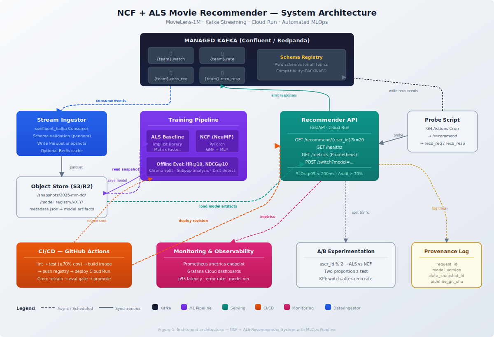

# 🎬 Movie Recommender System

> Real-time movie recommendation service using Neural Collaborative Filtering (NCF) + ALS on MovieLens-1M, with full MLOps pipeline.

**Course:** AIML Production Systems  
**Team:** Solo — [Your Name]  
**Status:** 🟢 Active

---

## Overview

A production-grade recommendation system that:
- Ingests watch/rating events via **Kafka** (Confluent Cloud)
- Trains two models: **ALS** (baseline) and **NCF/NeuMF** (primary)
- Serves personalized top-K recommendations via **FastAPI** on **Google Cloud Run**
- Automates retraining, A/B testing, monitoring, and model versioning

## Architecture



See [docs/](docs/) for detailed architecture documentation.

## API Endpoints

| Endpoint | Method | Description |
|----------|--------|-------------|
| `/recommend/{user_id}?k=20&model=` | GET | Top-K movie IDs (CSV); optional model selector |
| `/healthz` | GET | Liveness probe: status + model version |
| `/metrics` | GET | Prometheus metrics (latency, counters, errors) |
| `/switch?model=vX.Y` | POST | Hot-swap active model (token-gated) |

### SLOs
- **Availability:** ≥ 70%
- **Latency:** p95 < 200ms
- **Error rate:** < 5%
- **Model freshness:** ≤ 7 days since retrain

## Quickstart

### Prerequisites
- Python 3.11+
- Docker
- Access to Confluent Cloud (Kafka)

### Local Development
```bash
# Clone the repo
git clone https://github.com/[YOUR_USERNAME]/movie-recommender-system.git
cd movie-recommender-system

# Create virtual environment
python -m venv venv
source venv/bin/activate  # or venv\Scripts\activate on Windows

# Install dependencies
pip install -r requirements.txt

# Set environment variables (copy template and fill in)
cp .env.example .env
# Edit .env with your Kafka credentials, etc.

# Run locally
uvicorn service.app:app --reload --port 8000
```

### Docker
```bash
# Build
docker build -t recommender-api .

# Run
docker run -p 8000:8000 --env-file .env recommender-api
```

### Run Tests
```bash
pytest tests/ -v --cov=service --cov=stream --cov-report=term-missing
```

## Project Structure

```
movie-recommender-system/
├── service/              # FastAPI app & model serving
│   ├── app.py            # Main API with /recommend, /healthz, /metrics, /switch
│   ├── models/           # ALS and NCF inference wrappers
│   │   ├── als_model.py
│   │   └── ncf_model.py
│   └── Dockerfile        # Multi-stage build for the API
├── stream/               # Kafka streaming pipeline
│   ├── consumer.py       # Confluent Kafka consumer
│   └── schemas/          # Avro / pandera schema definitions
│       └── events.py
├── training/             # Model training scripts
│   ├── train_als.py      # ALS via implicit library
│   ├── train_ncf.py      # NCF/NeuMF via PyTorch
│   └── evaluate.py       # Offline eval: HR@10, NDCG@10
├── scripts/              # Operational scripts
│   ├── probe.py          # Health/recommendation probes
│   ├── retrain.py        # Automated retrain pipeline
│   └── switch_model.py   # Model hot-swap trigger
├── tests/                # Test suite
│   ├── test_api.py       # API endpoint tests
│   ├── test_consumer.py  # Kafka consumer tests
│   └── test_models.py    # Model inference tests
├── .github/workflows/    # CI/CD & automation
│   ├── ci.yml            # Lint → test → build → push → deploy
│   ├── probe.yml         # Cron probe script
│   └── retrain.yml       # Scheduled retrain pipeline
├── monitoring/           # Observability
│   └── grafana_dashboard.json
├── docs/                 # Documentation
│   └── architecture_diagram.svg
├── .env.example          # Environment variable template
├── .gitignore
├── Dockerfile
├── requirements.txt
└── README.md
```

## Tech Stack

| Component | Choice |
|-----------|--------|
| Streaming | Confluent Cloud (Kafka + Schema Registry) |
| Compute | Google Cloud Run |
| Storage | Cloudflare R2 (S3-compatible) |
| Container Registry | ghcr.io (GitHub Packages) |
| CI/CD | GitHub Actions |
| Monitoring | Grafana Cloud (free tier) |
| ML | PyTorch (NCF) + implicit (ALS) |
| Validation | pandera + Confluent Schema Registry |

## Milestones

| MS | Focus | Status |
|----|-------|--------|
| M1 | Proposal, repo scaffold, architecture | ✅ Complete |
| M2 | Kafka wiring, model training, cloud deploy | ⬜ Upcoming |
| M3 | Evaluation, CI/CD, quality gates | ⬜ Upcoming |
| M4 | Monitoring, retrain, A/B, provenance | ⬜ Upcoming |
| M5 | Fairness, security, demo | ⬜ Upcoming |

## Live Links

- **API URL:** [To be added after M2 deploy]
- **GitHub Actions:** [Runs](../../actions)
- **Registry Images:** [Packages](../../pkgs/container/recommender-api)
- **Grafana Dashboard:** [To be added after M4]

## License

This project is for academic purposes as part of the AIML Production Systems course.
